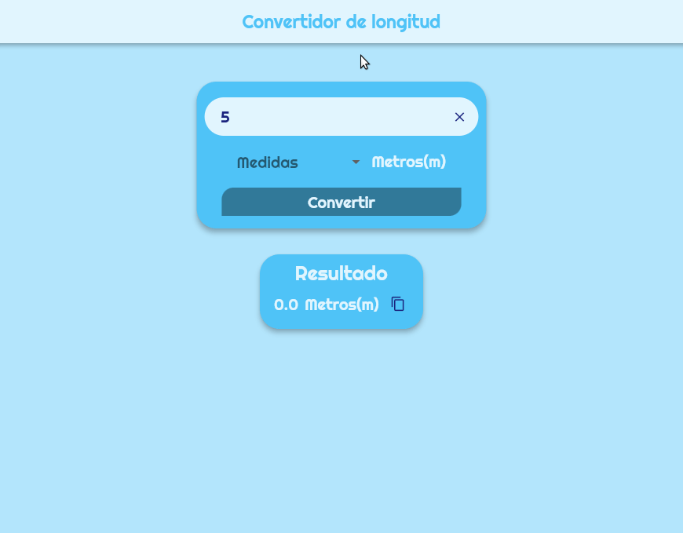

# Flutter Desktop Converter

A simple measure converter example that convert an amount from meters to kilometers or kilometers to meters. This example implements the BloC pattern.

## Constructed with 🛠️

- [Flutter](https://flutter.dev) - used Framework
- [Dart](https://dart.dev/) - used language

## Author ✒️

- **Eduardo Coto** - creator of proyect.

## License 📄

 This project is under the License(MIT)
